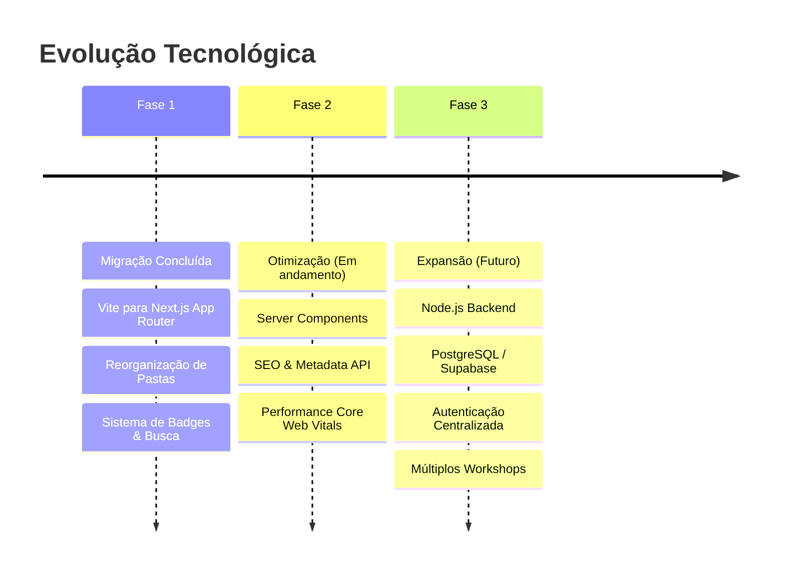
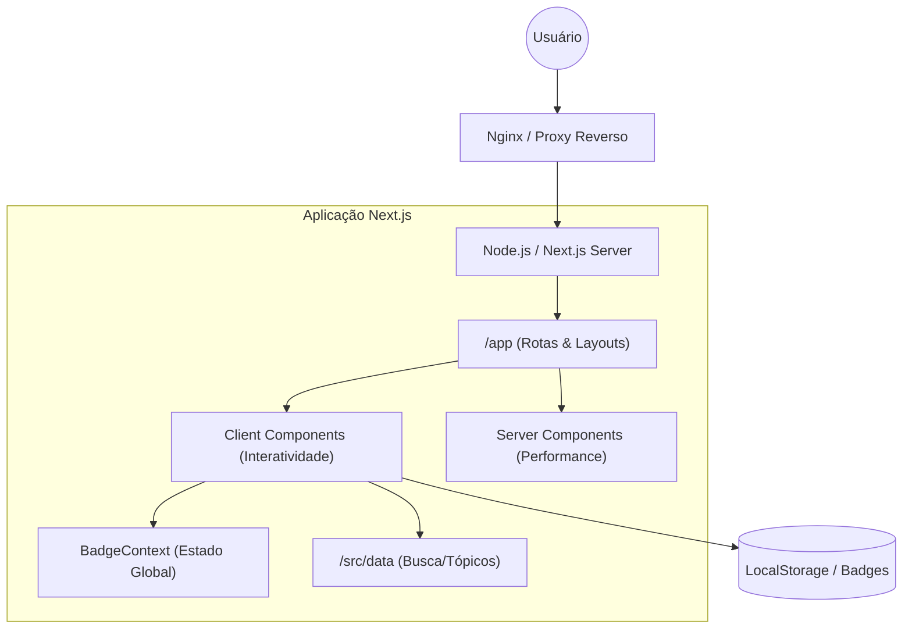

# 📖 Manual do Aluno: Do Zero ao Firewall Profissional

Bem-vindo ao guia definitivo do seu laboratório! Este manual foi desenhado para ser seu companheiro de bancada. Aqui você não encontra apenas comandos, mas o **porquê** de cada ação e como validar se seu castelo está seguro.

---

## 🚀 1. Instalação & Fundação (O Alicerce)

### Conceito
Antes de subir as paredes, precisamos de um terreno firme. O laboratório simula uma rede corporativa real com três zonas: **WAN** (Internet), **DMZ** (Servidores) e **LAN** (Usuários).

### Por Que Aprender Isso?
Sem uma base sólida de endereçamento IP e roteamento, seu firewall será apenas uma caixa preta. Entender o fluxo de pacotes é a diferença entre um administrador e um "digitador de comandos".

### Exemplo Prático
Habilitar o roteamento no kernel (essencial para o Firewall ser um Firewall):
```bash
sysctl -w net.ipv4.ip_forward=1
```

### Checklist de Validação
- [ ] O Firewall pinga o Gateway da WAN?
- [ ] O Firewall pinga o Web Server na DMZ?
- [ ] O Firewall pinga o Cliente na LAN?

### Erros Comuns
- **Esquecer o Gateway:** Se a VM não tem gateway, ela não sabe como sair da própria rede.
- **Placas de Rede Trocadas:** Confundir a `eth0` (WAN) com a `eth1` (LAN) no VirtualBox.

---

## 🌐 2. WAN & NAT (A Saída para o Mundo)

### Conceito
O **NAT (Network Address Translation)** permite que toda a sua rede interna (IPs privados) navegue na internet usando apenas um IP público.

### Por Que Aprender Isso?
IPs privados (192.168.x.x) não são roteáveis na internet. O NAT é o "tradutor" que permite a navegação e economiza endereços IP.

### Exemplo Prático (SNAT/Masquerade)
```bash
iptables -t nat -A POSTROUTING -o eth0 -j MASQUERADE
```

### Checklist de Validação
- [ ] O cliente da LAN consegue dar `ping 8.8.8.8`?
- [ ] A regra aparece no `iptables -t nat -L -n`?

### Erros Comuns
- **NAT na interface errada:** Aplicar o MASQUERADE na interface da LAN em vez da WAN.
- **Falta da regra FORWARD:** O NAT traduz, mas o FORWARD é quem deixa o pacote passar de uma placa para outra.

---

## 📖 3. DNS BIND9 (A Lista de Contatos)

### Conceito
O DNS transforma nomes amigáveis (`www.workshop.local`) em endereços IP que as máquinas entendem.

### Por Que Aprender Isso?
Ninguém decora IPs. Se o DNS falha, a rede "para", mesmo que a internet esteja funcionando. É o serviço mais crítico da infraestrutura.

### Exemplo Prático (Consulta Direta)
```bash
dig @192.168.56.100 www.workshop.local
```

### Checklist de Validação
- [ ] O `named-checkconf` não retorna erros?
- [ ] A zona reversa resolve o IP de volta para o nome?

### Erros Comuns
- **Esquecer o ponto final:** No arquivo de zona, nomes sem ponto final (ex: `ns1.workshop.local.`) causam erros bizarros.
- **Serial não incrementado:** Se você altera a zona e não aumenta o serial, os escravos não atualizam.

---

## 🔒 4. Nginx & SSL/TLS (O Cadeado Verde)

### Conceito
O SSL/TLS criptografa a conversa entre o navegador e o servidor, garantindo que ninguém no caminho consiga ler os dados.

### Por Que Aprender Isso?
Hoje, o HTTPS é obrigatório. Sites sem SSL são marcados como "Inseguros" e dados sensíveis (senhas) ficam expostos em redes Wi-Fi.

### Exemplo Prático (Gerar Chave e CSR)
```bash
openssl req -new -newkey rsa:2048 -nodes -keyout server.key -out server.csr
```

### Checklist de Validação
- [ ] O cadeado aparece verde no navegador?
- [ ] O Nginx redireciona automaticamente a porta 80 para 443?

### Erros Comuns
- **Permissões na Chave Privada:** A chave `.key` deve ser legível apenas pelo root (`600`).
- **Cadeado Amarelo:** Ocorre quando o site HTTPS carrega imagens via HTTP (Mixed Content).

---

## 🚪 5. Squid Proxy (O Filtro de Conteúdo)

### Conceito
O Proxy age como um intermediário. Ele recebe o pedido do usuário, verifica se o site é permitido e só então busca o conteúdo.

### Por Que Aprender Isso?
Empresas precisam controlar o que é acessado para evitar perda de produtividade e infecções por malware.

### Exemplo Prático (ACL de Bloqueio)
```bash
acl negados url_regex -i "/etc/squid/negados.txt"
http_access deny negados
```

### Checklist de Validação
- [ ] Sites em `negados.txt` retornam "Acesso Negado"?
- [ ] O log `/var/log/squid/access.log` mostra as navegações em tempo real?

### Erros Comuns
- **Ordem das ACLs:** Colocar o `http_access allow all` antes dos bloqueios.
- **HTTPS sem SSL Bump:** O Squid comum não consegue ler a URL de sites HTTPS, apenas o domínio.

---

## 🎯 6. DNAT & Port Forwarding (Abrindo as Portas)

### Conceito
O DNAT permite que alguém da internet acesse um servidor que está escondido dentro da sua rede (na DMZ).

### Por Que Aprender Isso?
É assim que você hospeda um site, um servidor de e-mail ou uma VPN atrás de um firewall.

### Exemplo Prático (Redirecionar porta 80 para o Web Server)
```bash
iptables -t nat -A PREROUTING -i eth0 -p tcp --dport 80 -j DNAT --to-destination 192.168.56.120
```

### Checklist de Validação
- [ ] O acesso ao IP da WAN na porta 80 cai no servidor interno?
- [ ] Existe uma regra no FORWARD permitindo esse tráfego?

### Erros Comuns
- **Esquecer o FORWARD:** O DNAT muda o destino, mas o filtro FORWARD ainda precisa autorizar a passagem.
- **Gateway do Servidor Interno:** O servidor na DMZ deve usar o Firewall como gateway, senão a resposta não volta para a internet.

---

## 🔑 7. Port Knocking (A Batida Secreta)

### Conceito
Uma técnica de segurança onde todas as portas (como o SSH) ficam fechadas, e só abrem se você "bater" em uma sequência secreta de portas.

### Por Que Aprender Isso?
Esconde seus serviços de scanners de hackers. Se a porta está "fechada", o atacante acha que não tem nada lá.

### Exemplo Prático (Sequência 1000 -> 2000 -> 3000)
```bash
# Se bater na 3000 e já passou pela 2000, abre por 10 segundos
iptables -A INPUT -p tcp --dport 22 -m recent --rcheck --name FASE3 -j ACCEPT
```

### Checklist de Validação
- [ ] O `nmap` mostra a porta 22 como `filtered`?
- [ ] Após a sequência de batidas, o SSH conecta com sucesso?

### Erros Comuns
- **Timeout muito curto:** Bater as portas devagar demais e o sistema esquecer a primeira batida.
- **Regra ESTABLISHED ausente:** Se você abrir a porta mas não tiver ESTABLISHED, a conexão cai assim que o tempo de abertura expirar.

---

## 🛡️ 8. VPN IPSec (O Túnel Seguro)

### Conceito
Cria um túnel criptografado através da internet para interligar duas redes distantes como se estivessem no mesmo prédio.

### Por Que Aprender Isso?
É o padrão ouro para interligar filiais (Site-to-Site) e permitir acesso remoto seguro para funcionários.

### Exemplo Prático (Status do StrongSwan)
```bash
ipsec statusall
```

### Checklist de Validação
- [ ] O status mostra `ESTABLISHED` e `INSTALLED`?
- [ ] A rede da Matriz pinga a rede da Filial?

### Erros Comuns
- **Chave PSK diferente:** Se as senhas não baterem nos dois lados, o túnel não sobe.
- **Firewall bloqueando UDP 500/4500:** O IPSec precisa dessas portas abertas para negociar as chaves.

---

*Este manual é um organismo vivo. Use-o, anote nele e, acima de tudo, **pratique**. O terminal não morde, ele ensina.*

---

## 🏗️ Estrutura de Pastas (Next.js App Router)

O projeto foi migrado para **Next.js 15+** utilizando o **App Router**. Abaixo está a explicação de cada diretório principal:

### `/app`
Este é o coração do roteamento do Next.js. Cada subpasta representa uma rota na URL.
- `layout.tsx`: Define a estrutura global (HTML, Body, Header, Footer).
- `page.tsx`: A página inicial (`/`).
- `globals.css`: Estilos globais e variáveis do Tailwind CSS.
- `providers.tsx`: Centraliza os contextos do React (como o `BadgeProvider`).
- `[rota]/page.tsx`: Define o conteúdo de cada página específica (ex: `/dashboard`, `/topicos`).

### `/src`
Contém a lógica de negócio e componentes reutilizáveis que não são rotas diretas.
- `/components`: Componentes UI (Botões, Cards, Modais, etc.).
  - `ClientLayout.tsx`: O layout do lado do cliente que lida com estados de menu e busca.
  - `Topology.tsx`: O mapa interativo da rede.
- `/context`: Contextos do React para gerenciamento de estado global (ex: `BadgeContext.tsx` para o sistema de gamificação).
- `/data`: Arquivos de dados estáticos (JSON/TS) que alimentam a busca e os tópicos.
- `/lib`: Funções utilitárias (ex: `utils.ts` para manipulação de classes CSS).

### Arquivos de Configuração
- `package.json`: Gerencia dependências e scripts (`dev`, `build`, `start`).
- `next.config.ts`: Configurações específicas do Next.js.
- `tsconfig.json`: Configurações do TypeScript.
- `.env.example`: Modelo para variáveis de ambiente.

---

## 🖥️ Processos de Desenvolvimento

### 1. Como Adicionar uma Nova Página
1. Crie uma nova pasta dentro de `/app` com o nome da rota desejada (ex: `/app/seguranca`).
2. Crie um arquivo `page.tsx` dentro dessa pasta.
3. Adicione a diretiva `'use client';` no topo se a página precisar de interatividade (hooks).
4. Adicione o link para a nova página no `NAV_LINKS` dentro de `src/components/ClientLayout.tsx` para que apareça no menu.

### 2. Como Modificar o Sistema de Badges
O sistema de badges (conquistas) é gerenciado pelo `BadgeContext.tsx`.
- Para adicionar uma nova badge: Atualize a lista inicial no contexto.
- Para desbloquear: Use a função `unlockBadge('id-da-badge')` em qualquer componente cliente.

**Exemplo Prático (Desbloqueando uma Badge):**
```tsx
'use client';
import { useBadges } from '@/context/BadgeContext';

export default function MyComponent() {
  const { unlockBadge } = useBadges();

  const handleAction = () => {
    // Lógica da ação...
    unlockBadge('expert-firewall'); // ID definido no BadgeContext
  };

  return <button onClick={handleAction}>Completar Desafio</button>;
}
```

### 3. Como Atualizar a Busca Global
Os itens da busca estão em `src/data/searchItems.ts`. Basta adicionar um novo objeto ao array para que ele apareça instantaneamente no `Ctrl+K`.

**Exemplo de Item de Busca:**
```ts
{
  id: 'iptables-rules',
  title: 'Regras de Iptables',
  description: 'Comandos comuns para firewall',
  href: '/wan-nat',
  category: 'Segurança'
}
```

---

## 🚀 Como Subir no Servidor (Deploy)

O projeto está configurado para ser executado em ambientes Node.js modernos.

### Passo 1: Instalação
```bash
npm install
```

### Passo 2: Build de Produção
Este comando compila o TypeScript e gera uma versão otimizada do site na pasta `.next`.
```bash
npm run build
```

### Passo 3: Iniciar o Servidor
Para rodar em produção:
```bash
npm run start
```

### 📦 Fluxo de Deploy: Estático vs Dinâmico

Dependendo da infraestrutura, o projeto pode ser configurado de duas formas:

1.  **Deploy Dinâmico (Node.js) - Padrão Atual:**
    *   **Como funciona:** O servidor Next.js roda em tempo real.
    *   **Vantagem:** Permite Server-Side Rendering (SSR), API Routes e revalidação de dados.
    *   **Comando:** `npm run build && npm run start`.

**Exemplo de Configuração Nginx (Proxy Reverso):**
```nginx
server {
    listen 80;
    server_name workshop.meudominio.com;

    location / {
        proxy_pass http://localhost:3000;
        proxy_http_version 1.1;
        proxy_set_header Upgrade $http_upgrade;
        proxy_set_header Connection 'upgrade';
        proxy_set_header Host $host;
        proxy_cache_bypass $http_upgrade;
    }
}
```

2.  **Exportação Estática (Static Export):**
    *   **Como funciona:** O Next.js gera apenas arquivos HTML/CSS/JS estáticos.
    *   **Configuração:** Adicionar `output: 'export'` no `next.config.ts`.
    *   **Limitação:** Não suporta funções que rodam apenas no servidor (como API Routes dinâmicas).
    *   **Uso:** Ideal para hospedar no GitHub Pages ou em um bucket S3/Nginx sem Node.js.

**Exemplo de Configuração Nginx (Static Export):**
```nginx
server {
    listen 80;
    server_name workshop-static.meudominio.com;
    root /var/www/workshop-linux/out;
    index index.html;

    location / {
        try_files $uri $uri.html $uri/ =404;
    }

    # Cache de assets estáticos
    location /_next/static/ {
        expires 365d;
        access_log off;
    }
}
```

### ✅ Checklist de Deploy Rápido

Use esta lista para garantir que nada foi esquecido antes de subir para produção:

- [ ] **Dependências:** `npm install` executado sem erros.
- [ ] **Variáveis de Ambiente:** Arquivo `.env.production` configurado no servidor.
- [ ] **Build:** `npm run build` finalizado com sucesso.
- [ ] **Lint & Types:** `npm run lint` não retornou erros críticos.
- [ ] **Porta:** Servidor configurado para ouvir na porta correta (padrão 3000).
- [ ] **Process Manager:** PM2 ou Docker configurado para reiniciar em caso de queda.
- [ ] **SSL/HTTPS:** Certificado configurado no Nginx/Proxy reverso.

### Dicas para Deploy:
- **Vercel:** Basta conectar o repositório; o Next.js é detectado automaticamente.
- **Docker:** Utilize uma imagem base `node:20-alpine` e execute os comandos acima.
- **PM2:** No servidor Linux, você pode usar `pm2 start npm --name "workshop-linux" -- run start`.

---

## 🔒 Segurança e Manutenção Preventiva

A segurança do ecossistema é uma responsabilidade contínua. Siga este cronograma de auditoria:

### 🗓️ Checklist Periódico de Segurança

#### **Semanal: Validação de Ambiente**
- [ ] Verificar se novas variáveis `NEXT_PUBLIC_` foram adicionadas e se são realmente necessárias no cliente.
- [ ] Validar logs de acesso do Nginx em busca de padrões de ataque (brute-force).
- [ ] Garantir que o arquivo `.env` de produção não foi exposto ou alterado indevidamente.

#### **Mensal: Higiene de Código**
- [ ] Executar `npm audit` e corrigir vulnerabilidades críticas.
- [ ] Revisar permissões de escrita nos diretórios do servidor.
- [ ] Validar se a sanitização de inputs (XSS) está sendo aplicada em novos formulários.

#### **Trimestral: Auditoria Estrutural**
- [ ] Revisar as regras de `iptables` do servidor de produção.
- [ ] Atualizar certificados SSL (se não forem auto-renováveis).
- [ ] Testar o fluxo de recuperação de desastres (restore de backups de configuração).

### Exemplos de Implementação Segura

**1. Variáveis de Ambiente:**
```tsx
// .env.local
NEXT_PUBLIC_API_URL=https://api.meuprojeto.com
STRIPE_SECRET_KEY=sk_test_... // Não acessível no cliente

// No componente (Client Component)
const apiUrl = process.env.NEXT_PUBLIC_API_URL; // Funciona!
const secret = process.env.STRIPE_SECRET_KEY; // undefined (Seguro!)
```

**2. Sanitização de Input (Prevenção XSS):**
```tsx
const handleNameChange = (e: React.ChangeEvent<HTMLInputElement>) => {
  // Remove tags HTML e caracteres suspeitos para evitar XSS
  const sanitizedValue = e.target.value.replace(/<[^>]*>?/gm, '').trim();
  setName(sanitizedValue);
};
```

---

## 🚀 Roadmap Técnico

O projeto está em constante evolução. Abaixo, a linha do tempo de transição tecnológica:



---

## 📡 Arquitetura do Sistema



*Nota: Atualmente, o "Banco de Dados" é o LocalStorage do navegador do usuário.*

---

## 📖 Glossário Técnico

*   **App Router:** O sistema de roteamento do Next.js baseado em pastas, onde cada pasta com um arquivo `page.tsx` se torna uma rota pública.
*   **Client Component:** Componentes que rodam no navegador (usam `'use client';`). São necessários para usar Hooks (`useState`, `useEffect`) e eventos de clique.
*   **Server Component:** Componentes que rodam apenas no servidor. São mais rápidos e seguros, mas não possuem interatividade direta.
*   **BadgeContext:** O provedor de estado que rastreia o progresso do usuário e desbloqueia conquistas (badges) durante a navegação.
*   **Tailwind CSS v4:** Framework de CSS utilitário usado para estilização rápida e consistente sem escrever arquivos CSS manuais.

---

## 🛠️ Manutenção Futura

- **Atualização de Dependências:** Use `npm update` regularmente, mas verifique se não há mudanças que quebrem o `motion` ou o `lucide-react`.
- **Estilização:** O projeto usa **Tailwind CSS v4**. Evite criar arquivos CSS separados; use as classes utilitárias diretamente nos componentes.
- **Acessibilidade:** Sempre mantenha os atributos `aria-label` e `role` nos botões e menus, conforme implementado no `ClientLayout.tsx`.

---

## 📽️ Slide Deck: Apresentação Executiva

*Copie este conteúdo para um visualizador de Markdown ou slides para reuniões rápidas.*

---
### Slide 1: Visão Geral e Proposta de Valor
- **Projeto:** Workshop Linux - Do Zero ao Firewall.
- **Tecnologia:** Next.js 15 (App Router), Tailwind CSS v4, Lucide Icons.
- **Missão:** Democratizar o conhecimento de infraestrutura Linux através de uma plataforma interativa, gamificada e de alta performance.
- **Diferencial:** Experiência imersiva com sistema de badges e busca global instantânea.

---
### Slide 2: Arquitetura e Escalabilidade
- **Frontend:** Interface reativa com foco em UX (Framer Motion).
- **Processamento:** Renderização híbrida (SSR/Static) para máxima velocidade.
- **Infraestrutura:** Nginx como Proxy Reverso garantindo segurança e cache.
- **Evolução de Dados:** Transição planejada de LocalStorage para PostgreSQL/Supabase.

---
### Slide 3: Governança e Segurança
- **Checklist de Auditoria:** Rotinas semanais e mensais de segurança.
- **Proteção de Dados:** Sanitização rigorosa de inputs e isolamento de segredos via `.env`.
- **Infraestrutura Segura:** Implementação do Princípio do Menor Privilégio via Iptables.
- **Compliance:** Monitoramento de vulnerabilidades via `npm audit`.

---
### Slide 4: Roadmap Estratégico
- **Fase Atual:** Estabilização da arquitetura Next.js e otimização de SEO.
- **Próximo Marco:** Implementação de Server Components para redução de bundle.
- **Visão de Futuro:** Backend robusto, autenticação multi-usuário e suporte a múltiplos workshops simultâneos.

---
### Slide 5: Mensagens-Chave
- **Leve hoje:** Arquitetura otimizada, rápida e focada no usuário.
- **Escalável amanhã:** Estrutura pronta para expansão de dados e usuários.
- **Seguro sempre:** Cultura de auditoria e segurança por design.

---

*Bem-vindo à equipe! Se tiver dúvidas, consulte os comentários no código ou a documentação oficial do Next.js.*
